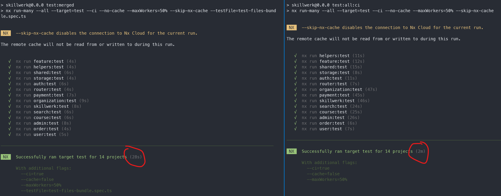

# NxJestMerge
Merges all tests in NX projects into a single file that can be executed faster.

## Usage

### Merging tests
```
nxjestmerge <workspace folder>
```

This will create a `test-files-bundle.spec.ts` file in the `sourceRoot` path of every nx project that is found in the workspace.
This file will contain all the tests from the project.

### Running tests
```
nx run-many --target=test --all --testFile=test-files-bundle.spec.ts
```
(`--testFile=test-files-bundle.spec.ts` is the important part)

This will use your existing jest configuration but only run the merged tests.

## Results
In a project with approximately 1000 tests, the time to run the tests went from 2m to 28s.

